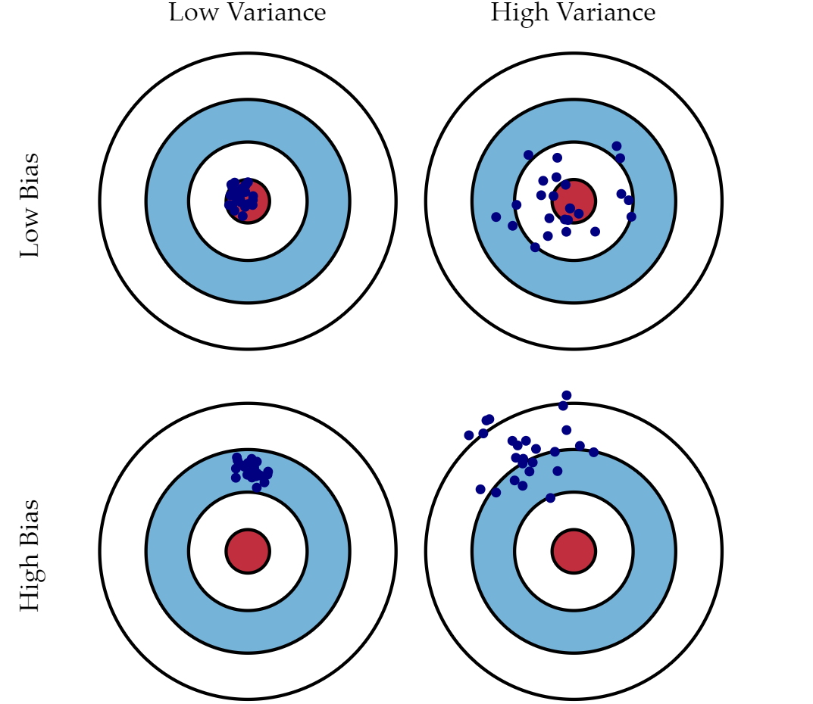

```{r setup, include=FALSE}
knitr::opts_chunk$set(echo = FALSE)
options(tinytex.verbose = TRUE)
```

```{r, echo = F, results = "hide", message = FALSE, warning = FALSE}
# aux functions
source("./../../Code/Misc/Auxilliary.R")

# packages
get.package(c("ggplot2", "patchwork", "kableExtra"))
```

# Motivation:  The Importance of Public Auctions

Auctions are a vital tool for governments to procure contracts. For construction contracts, first price sealed bid auctions are of particular importance.

* The authorities of the European Union for example spent around 14\% of their GDP on public procurement in 2017 [@GarciaRodriguez2020].

* Similar observatios can be made for the U.S. economy, one state of particular importance for this thesis is Colorado. 

* In 2021 the Budget for Transportation in Colorado amounted to roughly \$2 billion. Out of this Budget the CDOT awarded \$790 millions worth of contracts to construct design and repair bridges and highways. All of those contracts were procured via first price sealed bid auctions.

# Thesis Overview

* Provide an award price prediction model for the Colorado Department of Transportation.

  + This model would enable the auctioning entity to plan their budget more accurately.
  
* Unsupervised Collusion Detection

  + Examine whether the interaction of certain bidders has an effect on award prices. A significant interaction effect could allude to the existance of a bid rigging scheme.

# Data: Source

An example of a bid tab, as published on the website of the CDOT.

```{r, out.width = "80%", fig.align = "center", fig.cap = "Bid Tab Example"}
knitr::include_graphics("./../figures/Bid_Tab_exmpl.PNG")
```

# Data: Extraction

* The following text based data was extracted utilizing the package *pdftools* and regular expressions [@pdftools]:
  + Contract ID
  + County
  + Contract Time
  + Contract Description

* The table containing the bids, the unique bidder intentifiers and the engineer's estimate was extracted utilizing the R package *tabulizer* [@tabulizer].

# Data: Final Dataset 

The final dataset features 430 observations and 1086 variables.

* County
* Letting month
* Letting year
* Contract time
* Number of bidders
* Engineer's estimate
* Award price
* 169 binary variables, representing the bidder identities
* 652 binary variables, representing pair-wise bidder interaction terms 
* 258 binary variables, representing the contract description hit words

# Methods

For the Prediction Model the following models were applied utilizing different preprocessing schedules:

* Elastic net
* Random forest
* eXtreme Gradient Boosting
* OLS estimated linear model 

# Methods: Elastic Net
Given the model matrix $\mathbf{X} \in \mathbb{R}^{n\times p}$ and a dependent variable $\mathbf{y} \in \mathbb{R}^n$, we may formulate the elastic net as a linear model that utilizes $\ell_1$ and $\ell_2$ regularization. Further, suppose that $\alpha \in [0, 1]$ and $t \in \mathbb{R}^+$, we can then define the elastic net estimator as a constrained minimization problem, 

$$ 
\boldsymbol{\hat{\beta}} = \underset{\boldsymbol{\beta}}{\text{arg min}} |\mathbf{y} - \mathbf{X}\boldsymbol{\beta}|^2,
$$
subject to,

$$
(1 - \alpha)|\boldsymbol{\beta}|_1 + \alpha|\boldsymbol{\beta}|^2 \leq t. 
$$
Where,

$$
|\boldsymbol{\beta}|_1 = \sum\limits_{i = 1}^{p}|\boldsymbol{\beta}_i|\text{ and } |\boldsymbol{\beta}|^2 = \sum\limits_{i = 1}^{p}\boldsymbol{\beta}_i^2.
$$

# Regularized Regression: Intuition 

The best performing regularized model is a lasso regression model,i.e., $\alpha = 0$. The lasso penalty shrinks some elements of the parameter vector $\hat\beta$ exactly to zero. 

```{r, out.width = "90%", fig.align = "center", fig.cap = "Regularization Utilizing Different Norms (Toth 2022)"}
# graph

```

# Why use Lasso Regression instead of OLS

* Lasso allows us to fit a regression in cases where $p>>n$.

* Gauss Markov Theorem tells us that OLS is the best linear unbiased estimator but what if we do not mind a biased estimate?
  + Lasso offers a more flexible framework that allows us to optimize the bias variance tradeoff.
  
# Bias Variance Trade-Off

```{r, out.width = "80%", fig.align = "center", fig.cap = "Bias Variance Tradeoff (Fortmann-Roe 2012)"}
# graph

```

# Post Selection Inference: Motivation 

The derivation of a test statistic for a single covariate in our model usually assumes that the model is fixed, as if we knew ex ante which variables we need to include.

* Why is it problematic if we use the Data to choose the variables in our model?
  - A pre-selection that minimizes some predictive error, will choose variables that have a relationship with the dependent variable!
  - Thus we need to correct our inferential procedure for this selection event!
* Very informally speaking, we could say, a predictor needs to suprise us twice. Once to make it into the model and then another time to reject the $H_0$ of our significance test.

# Results: Out of Sample Performance

```{r, out.width = "90%", fig.align = "center", fig.cap = "Performance Comparison"}
# graph
knitr::include_graphics("./../figures/percomp_pres.pdf")
```

# Results: Out of Sample Performance

The following table lists the performance of the applied methods utilizing linear and quadratic loss functions, i.e.,

$$ RMSE = \sqrt{\frac{1}{n}\sum_{i = 1}^n (\hat{y} - y)^2} ,$$
$$  MAE = \frac{1}{n}\sum_{i = 1}^n |\hat{y} - y|. $$

```{r}
# table
kbl <- readRDS("./../figures/kbl.RDS")
kbl <- kbl[, order(kbl[2, ])]
knitr::kable(kbl, 
             col.names = c("Lasso", "Eng. Est.", "logPCA_RF", "rfe_RF", "XGB", "logPCA_LM")) |> 
  kable_styling(font_size = 7)
```

# Unsupervised Colusion Detection: Post-Selection Inference

The R package that was used to obtain the test statistics to determine the significance of our estimates is called \textit{selectiveInference} by @selectiveInference. It is based on a paper by the same authors called \textit{Post-selection inference for L1-penalized likelihood models} [@tib2016].

* The CV optimal value for our shrinkage parameter leads us to a model with 17/1085 variables.
  - 11 of those are firm interaction terms.
  - 2 are description hit words.
  - The remaining variables are Contract time, a county and a unique bidder identifier
* For the 430 auctions at hand no signficant interactions were detected!

# Thesis Repository

If you are interested to learn more about the application of machine learning methods to predict procurement auction award prices you can find my thesis including the data and the code here: \textcolor{teal}{\textit{github.com/Base-R-Best-R/Auction}}.

Also, if you are interested to learn more about post-selection inference. Prof. Loftus held a very insightful and easy to understand presentation which is available on youtube: \textcolor{teal}{\textit{youtube.com/watch?v=bQhEALoxoGE}}.

# References {.allowframebreaks} 
